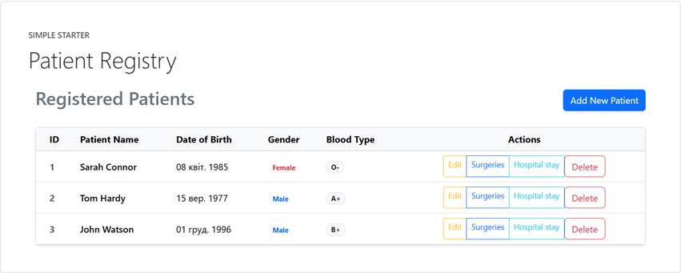
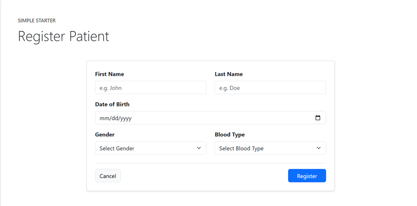
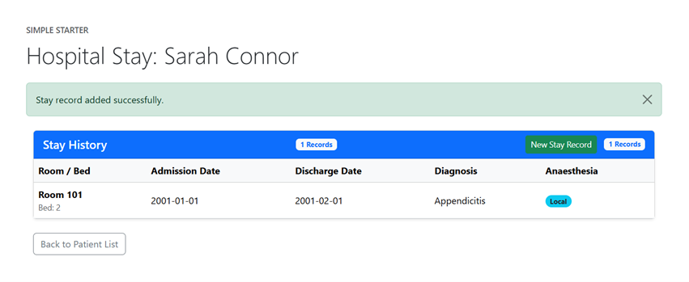
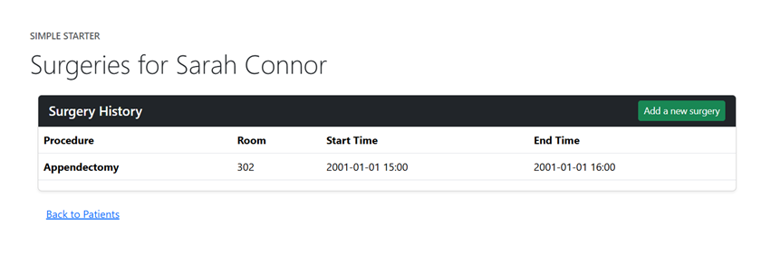

# App - Surgery Patients
## Stack

- Java 21+
- Gradle
- Spring Boot
- Spring Data JDBC
- Thymeleaf
- Liquibase
- MySQL

## Project Structure

- `src/main/java/org/example/app/TemplateApplication.java`: Spring Boot entry point
- `src/main/java/org/example/app/IndexController.java`: Root index controller
- `src/main/java/org/example/app/ErrorControllerAdvice.java`: Global exception handler

**Patient Domain (`src/main/java/org/example/app/patient/`)**
- `Patient.java`: Entity
- `PatientController.java`: Web controller (includes `PatientForm`)
- `PatientRepository.java`: Database access (includes `PatientMedicalSummary`)

**Surgery Domain (`src/main/java/org/example/app/surgery/`)**
- `Surgery.java`: Entity
- `SurgeryController.java`: Web controller (includes `SurgeryForm`)
- `SurgeryRepository.java`: Database access

**Hospital Stay Domain (`src/main/java/org/example/app/hospitalStay/`)**
- `HospitalStay.java`: Entity
- `HospitalStayController.java`: Web controller (includes `StayForm`)
- `HospitalStayRepository.java`: Database access

**Resources**
- `src/main/resources/db/changelog/0_schema.sql`: Database schema
- `src/main/resources/db/changelog/1_data.sql`: Seed dataset
- `src/main/resources/templates/`: Thymeleaf HTML pages

## Local Setup

The `docker-compose.yml` is already configured for the `surgery-patients-hw3` database. 

Start the database:

```bash
docker compose up -d
```

Verify your src/main/resources/application.properties has the matching values:

```properties
spring.datasource.url=${DB_URL:jdbc:mysql://localhost:3307/surgery-patients-hw3}
spring.datasource.username=${DB_USERNAME:root}
spring.datasource.password=${DB_PASSWORD:secret}
```

Or set environment variables:

```bash
export DB_URL=jdbc:mysql://localhost:3307/surgery-patients-hw3
export DB_USERNAME=root
export DB_PASSWORD=secret
```

Run the project:

```bash
./gradlew bootRun
```

Open:

```text
http://localhost:8080
```

The screens of working web application:





